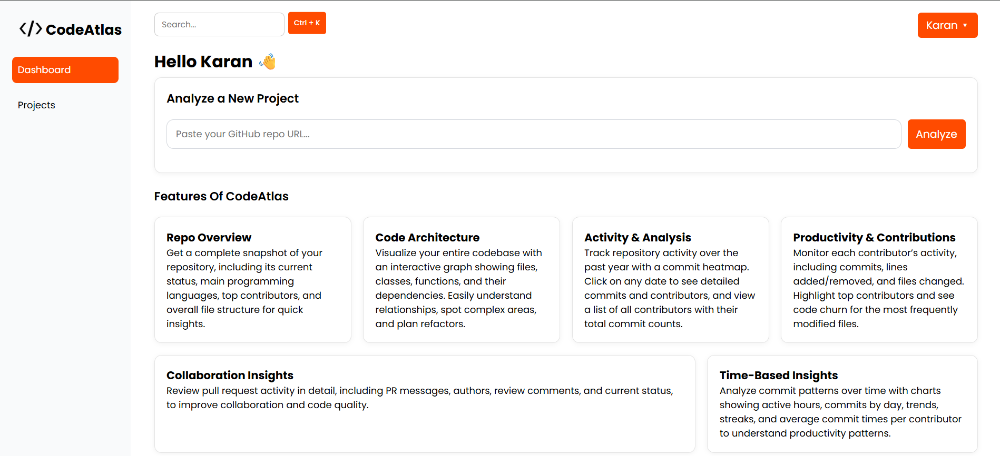
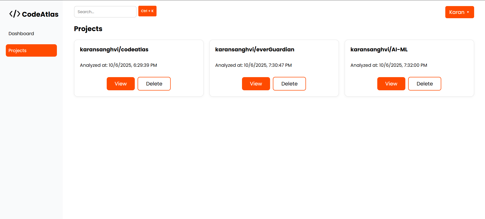
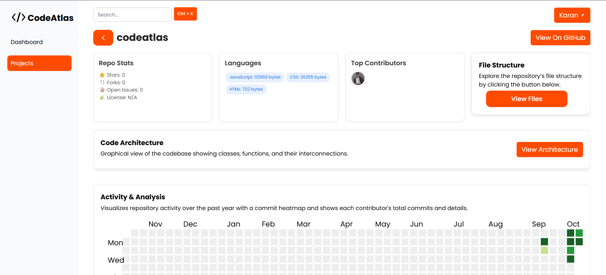
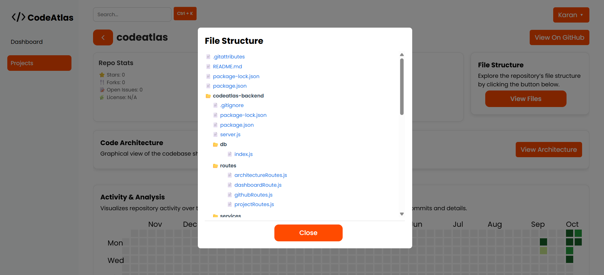
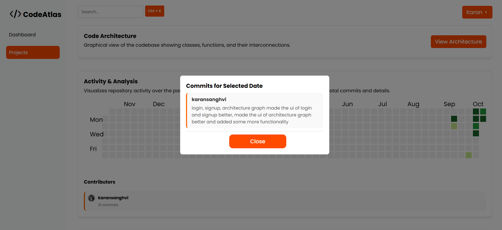
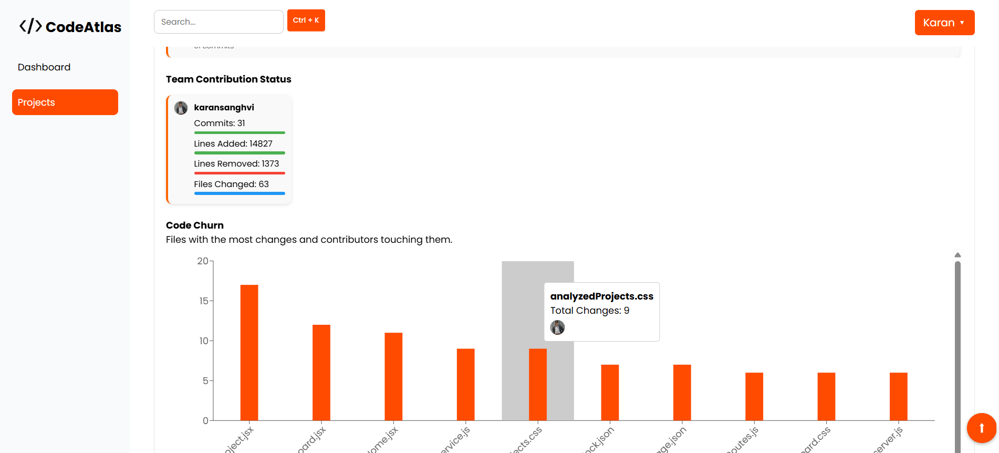
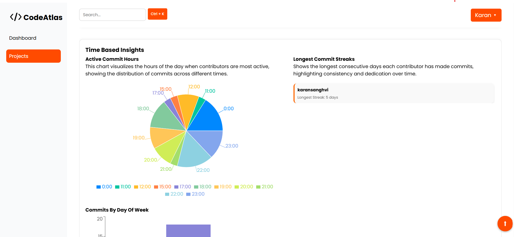
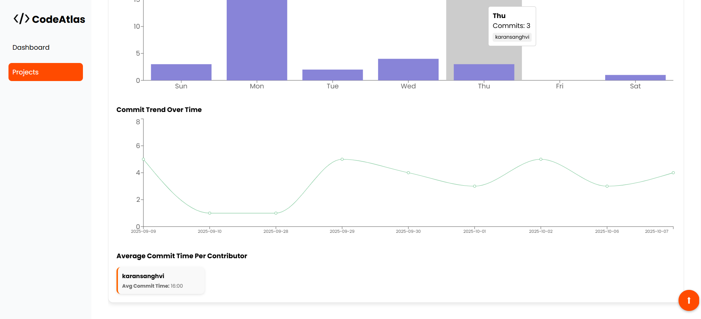

# CodeAtlas - Your Codebase, Visualized

CodeAtlas is an interactive analytics and visualization platform for software repositories. It helps developers, teams, and managers explore their codebases visually, track contributions, analyze productivity, and uncover valuable insights about collaboration and code evolution.

## ✨ Key Features
### 🗂️ 1. Repo Overview

Gain a quick snapshot of your repository with details like:
1) Repo Status — See if the project is active and healthy.
2) Languages Used — Discover which programming languages dominate your codebase.
3) Top Contributors — Identify the main contributors driving the project.
4) File Structure — Visualize your directory hierarchy to understand project organization.

### 🧩 2. Code Architecture
Visualize your codebase structure with an interactive graph that displays:

1) Files, classes, and functions
2) Dependencies and relationships between modules
3) Complexity and coupling hotspots

### 📊 3. Activity & Analysis
Analyze your project’s evolution and contribution trends:

1) Commit Heatmap — Displays commit frequency over the past year.

2) Date-based Commit Details — Click any date to view detailed commit logs, including author and message.

3) Contributor Stats — See each contributor’s total commits and their active contribution periods.

### ⚙️ 4. Productivity & Contributions
Dive deeper into how each contributor impacts the codebase:

1) Commits, Lines Added/Removed, Files Changed — Detailed breakdown per contributor.

2) Top Contributor Highlight — Recognizes the most active developer.

3) Team Contributions Summary — See overall team productivity at a glance.

4) Code Churn — Lists the top 10 most frequently changed files, showing total commits and contributors who touched them.

5) Great for identifying core files, ownership, and maintenance effort.

### 🤝 5. Collaboration Insights
Understand collaboration dynamics through Pull Request analytics:

1) View PR messages, authors, comments, and review discussions.

2) Track PR status (open, merged, closed) for better workflow visibility.

3) Gain insights into review participation and communication efficiency.

### ⏱️ 6. Time-Based Insights
Discover when and how your team commits code:

1) Active Commit Hours — Visualizes hours of the day with the most commits.

2) Commits by Day of Week — Shows which days contributors are most active.

3) Commit Trends Over Time — A line chart representing project progress.

4) Longest Commit Streaks — Highlights the most consistent contributors.

5) Average Commit Time per Contributor — Displays when each contributor typically commits.


## Tech Stack

**Frontend:** React.js, Tailwind CSS, Cytoscape.js (for architecture graph)

**Backend:** Node.js, Express

**Database:** PostgreSQL

**Version Control Integration:** GitHub API / Local Repo Parsing

**Visualization Libraries:** Chart.js, Recharts

**Authentication:** Firebase


## Installation

Clone the repository

```bash
  git clone https://github.com/yourusername/codeatlas.git
  cd codeatlas
```
Install dependencies

```bash
  cd codeatlas-frontend && npm install
  cd ../codeatlas-backend && npm install
```
Start the backend

```bash
  nodemon server.js
```
Start the frontend

```bash
  cd codeatlas-frontend
  npm run dev
```
Open http://localhost:3000 to explore CodeAtlas.

## Screenshots

















## Feedback

If you have any feedback, please reach out to us at karansanghvi1303@gmail.com


## License

This project is licensed under the MIT License.

